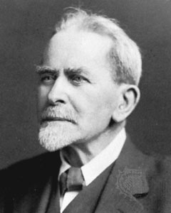

# Theorien und Methoden der Religionswissenschaft

### James Frazer: Magie, Religion und Wissenschaft im „Goldenem Zweig"

Sommersemester 2024  
Prof. Dr. Catherina Wenzel & Prof. Dr. Nathan Gibson

## 📈 Rückblick

Edward Tylor

## Heutiges Lernziel

Frazers Versuch, alle Religionen auf eine gemeinsame Wurzel zurückzuführen, als andauernd prägend wahrzunehmen.

## Sir James George Frazer: Leben

- geb. 1854 in Glasgow
- in Helensburgh, Schottland groß geworden
- studierte in Glasgow und Cambridge

## The Golden Bough (Der Goldene Zweig)



<figcaption>Painting by J. M.W. Turner (1834). Digital image by &lt;a href=&quot;//commons.wikimedia.org/wiki/User:Archaeodontosaurus&quot; title=&quot;User:Archaeodontosaurus&quot;&gt;Didier Descouens&lt;/a&gt; - &lt;span class=&quot;int-own-work&quot; lang=&quot;en&quot;&gt;Own work&lt;/span&gt;, Public Domain, <a href="https://commons.wikimedia.org/w/index.php?curid=122639818">Link</a>.</figcaption>

## The Golden Bough (Der Goldene Zweig)

Auflagen: 
- 1890 (2 Bände)
- 1900 (3 Bände)
- 1906–1915 (12 Bände)
- 1922 (abridged)
- 1936 ("Aftermath")

## The Golden Bough: A Study in Comparative Religion, 1. Auflage (1890)

> (1890, vii) For some time I have been preparing a general work on primitive superstition and religion. Among the problems which had attracted my attention was the hitherto unexplained rule of the Arician priesthood; and last spring it happened that in the course of my reading I came across some facts which, combined with others I had noted before, suggested an explanation of the rule in question. As the explanation, if correct, promised to throw light on some obscure features of primitive religion, I resolved to develop it fully, and, detaching it from my general work, to issue it as a separate study. This book is the result.

## The Golden Bough: A Study in Magic and Religion, 2. Auflage (1900)

> (1900, xiii) The kind reception accorded by critics and the public to the first edition of The Golden Bough has encouraged me to spare no pains to render the new one more worthy of their approbation. 

## The Golden Bough, 2. Auflage (1900)

> (1900, xvi) But while my views, tentative and provisional as they probably are, thus remain much what they were, there is one subject on which they have undergone a certain amount of change, unless indeed it might be more exact to say that I seem to see clearly now what before was hazy. I mean the relation of magic to religion. When I first wrote this book I failed, perhaps inexcusably, to define even to myself my notion of religion, and hence was disposed to class magic loosely under it as one of its lower forms. I have now sought to remedy this defect by framing as clear a definition of religion as the difficult nature of the subject and my apprehension of it allowed. 

## The Golden Bough, 2. Auflage (1900)

> (1900, xvii) No one can well be more sensible than I am of the immense variety and complexity of the forces which have gone towards the building up of religion; no one can recognise more frankly the futility and inherent absurdity of any attempt to explain the whole vast organism as the product of any one simple factor. 

## The Golden Bough, "Aftermath" (1936)

> (Aftermath 1936, v)  In that work, as in all my other writings, I have sought to base my conclusions by strict induction on a broad and solid foundation of well-authenticated facts. ...  If my writings should survive the writer, they will do so, I believe, less for the sake of the theories which they propound than for the sake of the facts which they record. They will live, if they live at all, as a picture or moving panorama of the vanished life of primitive man all over the world, from the Tropics to the Poles, groping and stumbling through the mists of ignorance and superstition in the eternal search after goodness and truth.

## The Golden Bough, "Aftermath" (1936)

> (Aftermath 1936, vi) I was beguiled, as by some subtle enchanter, into inditing what I cannot but regard as a dark, a tragic chronicle of human error and folly, of fruitless endeavour, wasted time, and blighted hopes. At the best the chronicle may serve as a warning, as a sort of Ariadne’s thread, to help the forlorn wayfarer to shun some of the snares and pitfalls into which his fellows have fallen before him in the labyrinth of life.

## Einprägungen

- W. Mannhardt (1831–1880, Germanic mythology)
- W. Robertson Smith (1846–1894, tried for heresy in 1870s)
  - Frazer: "the central idea of my essay— the conception of the slain god— is derived directly, I believe, from my friend"
- E. B. Tylor
- G. A. Wilken (Ethnologist, Dutch East Indies)
- Walter Gregor (1825–1897, Scottish Folklorist)
- Francis Darwin (1848–1925, son of Charles Darwin) 

## Ziel?

<iframe data-src="assets/pdf/frazer-1925-v.pdf" data-preload width="100%" height="100%"></iframe>

## Voraussetzungen?

## Belegen & Quellen?

<iframe data-src="assets/pdf/frazer-de-1977-76-79.pdf" data-preload width="100%" height="100%"></iframe>

## Argument: Magie, Religion, und Wissenschaft

## Langfristige Wirkung