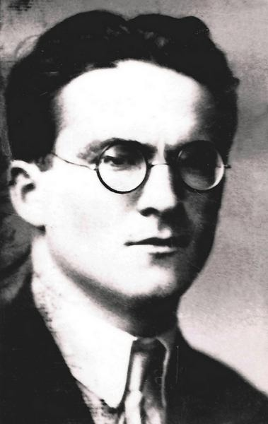
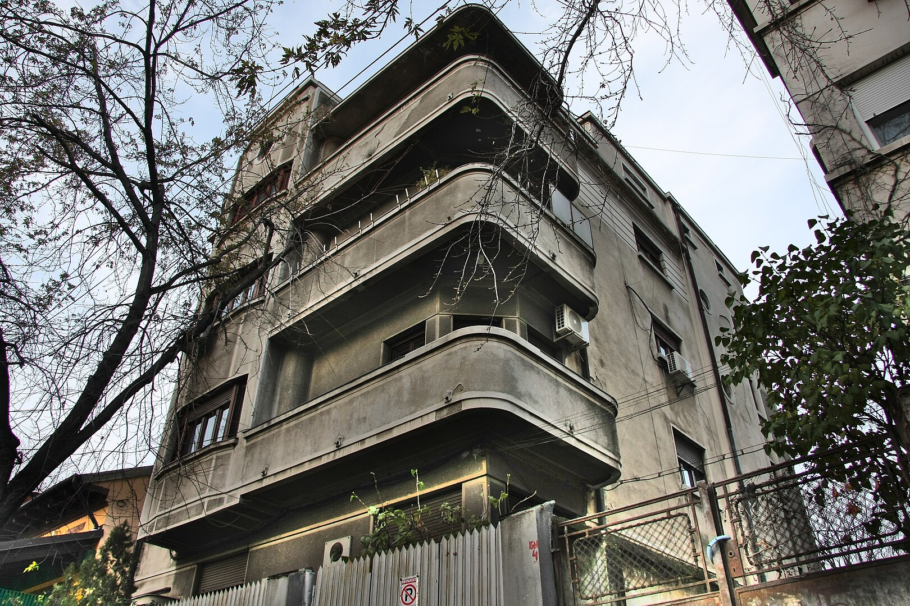
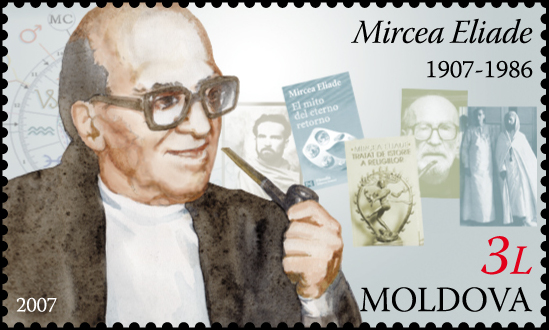
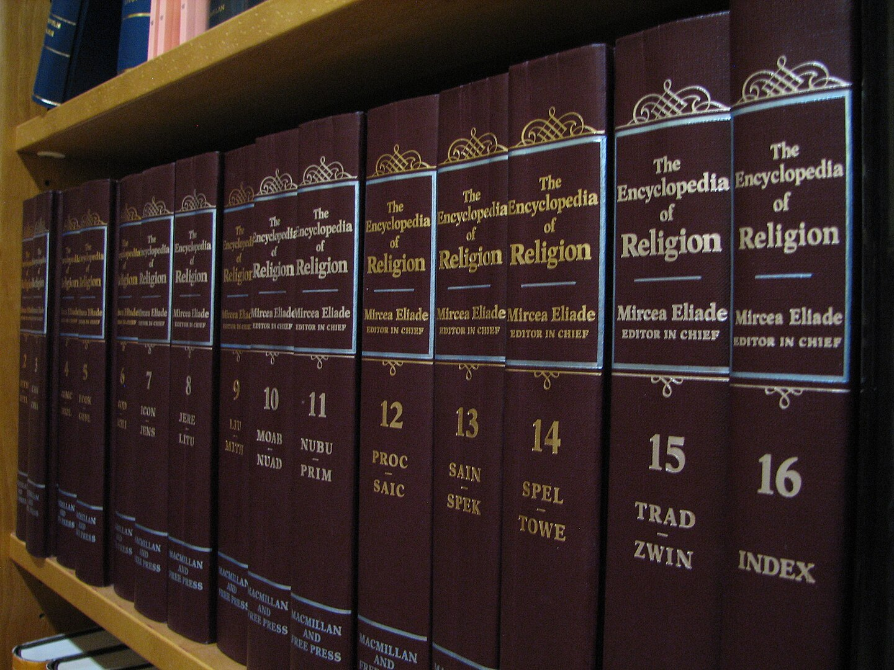
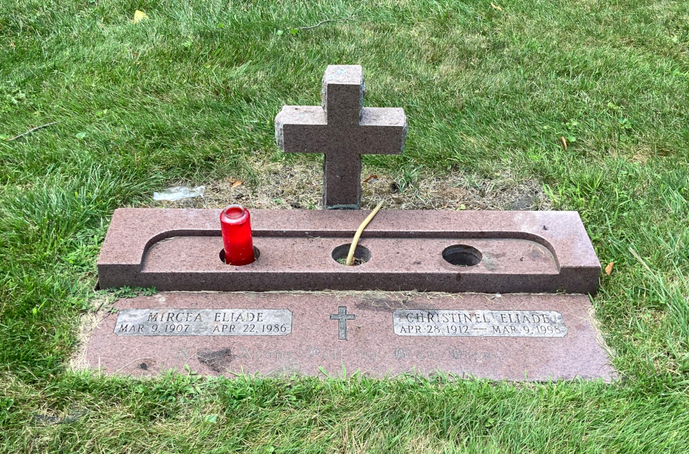

# Theorien und Methoden der Religionswissenschaft

### Mircea Eliade: Phänomenologie des Mythos und Rituals

Sommersemester 2024  
Prof. Dr. Catherina Wenzel & Prof. Dr. Nathan Gibson

## Rückblick: Rudolf Otto

- Das Numinose
  - Mysterium tremendum
  - Mysterium fascinosum
- Heilige = Numinose + Sittliche + Rationale

## Heutiges Lernziel

Phänomenologische Ansätze am Beispiel von Eliades Konzeption des „Heiligen und des Profanen“ erkennen und anwenden.

## Gliederung

Mircea Eliade (1907-1986)

- Leben
- "Das Heilige und das Profane"
  - Raum
  - Zeit
  - Natur
  - Existenz des Menschen
- Diskussion: Auswirkungen

## Leben

- geboren 1907, Bukarest
- erstes Roman mit 14
- Epiphanie als Kind
  > I practiced for many years [the] exercise of recapturing that epiphanic moment, and I would always find again the same plenitude. I would slip into it as into a fragment of time devoid of duration—without beginning, middle, or end. (Eliade, Autobiography, in Ellwood, pp. 98–99)

## Leben

- Studium (Philosophie) in Bukarest
- ab ca. 1928 Studienaufenthalt in Indien
- 1933 Promovierte zu Yoga-Praktiken

## Leben

> Als ich nach drei Jahren aus Indien zurückkam, verstand ich die Bedeutung unserer Volkstraditionen in Südosteuropa. Die ländlichen Kulturen und die traditionelle Folklore waren bei uns noch lebendig. Im Westen waren sie zwar nicht tot, aber ein wenig eingeschlafen. (Interview mit Paul Barbă Neagră für das Dokumentationsfilm „Mircea Eliade und die Wiederentdeckung des Heiligen“. 
https://www.deutschlandfunk.de/religionsphilosoph-mircea-eliade-heilung-durch-das-heilige-100.html)

## Leben

- unterstützte den Eisernen Gard (antisemitisch, faschistisch)
- eigene Reaktionen zu Antisemitismus etwas ambivalent (s. Manea, "Happy Guilt," 1991)
 

## Leben

- 1956 University of Chicago, History of Religions

## Leben

[UChicago Papers Box 171](https://www.lib.uchicago.edu/e/scrc/findingaids/view.php?eadid=ICU.SPCL.ELIADEM#idp45021512)

- Tobacco pipe, undated
- 5 pencil sharpeners, undated
- Shoe horn, undated
- 4 keys, undated
- Pocketknife, undated
- Metal and glass (or amber) pill box, undated
- Embossed leather notebook, blank, undated
- Fabric notebook, undated
- Mechanical pencil, undated

## Leben

 

## Leben

- 1986 in Chicago gestorben

## "Das Heilige und das Profane"

- Rudolf Otto 13 §2
- Hierophanie - etwas Heiliges sich uns zeigt
- 15 §1
- 16-17
- homo religiosus

## Heiliger Raum

## Heilige Zeit

## Die Heiligkeit der Natur

## Die Existenz des Menschen

## Auswirkungen

- Was will Eliade?
- Phänomenologie als Ansatz: methodische Vorteile und Nachteile?

### Notes

- connection to Otto/Heilige
- What is phenomenology, and what are its problems?
- Can we separate the ideas from the man's actions?

https://www.deutschlandfunk.de/der-einstein-der-religionsgeschichte-100.html

- überwiegend in Französisch, später auch in Englisch, sein belletristisches Qeuvre verfasste er ausschließlich in seiner Muttersprache Rumänisch.
- Biographie
  - Nach dem Philosophiestudium in Bukarest und einem dreijährigen Studienaufenthalt in Indien, promovierte Mircea Eliade 1933 über Techniken des Yoga
  - Von 1945 an lebte und lehrte Mircea Eliade in Paris, ab 1956 in Chicago, wo er den Lehrstuhl für Religionsgeschichte etablierte und dem Fach zu großer Popularität verhalf. 
- Ritualen 
  - Einweihungen, Initiationsriten (Erstaufführungen und Premieren)
- Werke
  - fünfbändige „Geschichte der religiösen Idee“,
  - eine Anzahl von Romanen und Erzählungen, die in zahlreiche Sprachen übersetzt wurden
    - 14 erstes Roman

https://www.deutschlandfunk.de/religionsphilosoph-mircea-eliade-heilung-durch-das-heilige-100.html

- „Die menschliche Existenz ist bedeutungslos geworden. Der Mensch lebt in einer Natur ohne Vorbild, ohne Schöpfer, ohne Ziel. Das ist der Nihilismus, den Nietzsche ausgerufen hat, als er sagte ‚Gott ist tot‘.“
- „Erinnerungen, Seite 116: In diesen Jahren nährten sich meine gesamten Anstrengungen von der Hoffnung, eines Tages alle ‚Geheimnisse‘ der Religionen, der Geschichte und überhaupt des Schicksals des Menschen auf der Erde mit einem Schlag zu lösen.“
- „Als ich nach drei Jahren aus Indien zurückkam, verstand ich die Bedeutung unserer Volkstraditionen in Südosteuropa. Die ländlichen Kulturen und die traditionelle Folklore waren bei uns noch lebendig. Im Westen waren sie zwar nicht tot, aber ein wenig eingeschlafen.“ (Der rumänische Filmemacher Paul Barbă Neagră hatte Eliade interviewt, für seine Dokumentation „Mircea Eliade und die Wiederentdeckung des Heiligen“.)
- Mircea Eliade: „Ich glaube, dass der Mensch so konstituiert ist: Seine Art, in der Welt zu sein, ist religiös zu sein – das heißt, die Erfahrung des Heiligen zu haben.“
- „Geschichte der religiösen Ideen, Band 1, Seite 7: Durch die Erfahrung des Heiligen hat der menschliche Geist den Unterschied zwischen dem erkannt, was sich als wirklich, mächtig, bedeutsam und sinnvoll enthüllt, und dessen Gegenteil – dem chaotischen und gefahrvollen Fluss der Dinge, ihrem zufälligen und sinnlosen Aufgang und Untergang. Mensch sein oder, besser: werden heißt ‚religiös‘ sein.“
- homo religiousus: ursprünglich-religiöser Mensch
- Hierophanie: Aufscheinen des Heiligen im Profanen.
- Kratophanie: Aufscheinen einer übernatürlichen Kraft.
- Mircea Eliade: „Für mich zeigt die Disziplin der Religionsgeschichte den Gesamtmenschen in dem Sinne, dass wir auch in den archaischen Völkern eine spirituelle Dimension entdecken, die sich in der gesamten Religionsgeschichte fortsetzt.“
- „Allmählich, nach der großen Revolution durch den jüdischen Monotheismus und vor allem durch die Propheten, wurde der Kosmos entsakralisiert. Judentum und Christentum wollten das Heilige aus dem Kosmos entfernen.“
- „Seite 155: Das Christentum der industriellen Gesellschaften, besonders das der Intellektuellen, hat seit langem seine kosmischen Werte eingebüßt. Zum Mysterium der Teilnahme der Natur am christologischen Drama haben die Christen einer modernen Stadt keinen Zugang mehr.“
- Der Literaturwissenschaftler Niels Penke von der Universität Siegen:
„... Es geht jetzt nicht darum, den Mythos sprach- oder zeichentheoretisch zu dechiffrieren oder ideologiegeschichtlich aufzuarbeiten, sondern es geht genau dahin, diesen Mythos wiederzufinden und zu zeigen, dass die Welt der Erscheinungen nicht alles ist. Und ich glaube, das verbindet Eliade und Jünger sehr stark.“
- „Unfruchtbarkeit, Langeweile, Dekadenz und Verfall – das sind Symptome unserer Zeit. Aber diesen modischen Ideen werden abgeschafft durch die Öffnung für andere geistige Welten, andere imaginären Universen. Diese Öffnung kann nicht ohne Wirkung sein.“ (Der rumänische Filmemacher Paul Barbă Neagră hatte Eliade interviewt, für seine Dokumentation „Mircea Eliade und die Wiederentdeckung des Heiligen“.)

UChicago Papers Box 171	https://www.lib.uchicago.edu/e/scrc/findingaids/view.php?eadid=ICU.SPCL.ELIADEM#idp45021512 

Tobacco pipe, undated
Box 171	

5 pencil sharpeners, undated
Box 171	

Shoe horn, undated
Box 171	

4 keys, undated
Box 171	

Pocketknife, undated
Box 171	

Metal and glass (or amber) pill box, undated
Box 171	

Embossed leather notebook, blank, undated
Box 171	

Fabric notebook, undated
Box 171	

Mechanical pencil, undated

#### Space

https://archive.org/details/sacredprofanenat00elia_0

- 20 sacred space, all other space is amorphous/formless
- nonhomogeneity as primordial experience
- break - central axis
- 22 center of the world
- 23 "even the most desacralized existence still preserves traces of a religious valorization of the world."
- 24 privileged places in life of individual "crypto-religious behavior"
- 24 church - read pars 1-2 of "Theophanies and Signs", also last par.
- hierophany
- 27 sign
- 33ff sacred poles, pillars, Milky Way (as axis mundi)
- 43 religious man always wanted to live at center of world
- 45 read par. "It follows that every construction or fabrication has the cosmogony as paradigmatic model..."
- 48 chaos, destruction of city vs. victory of gods
- 54 building sacrifices, cornerstone

## Vorschau