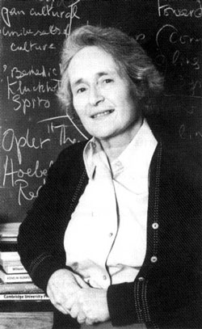

# Theorien und Methoden der Religionswissenschaft

### Mary Douglas: „Purity and Danger" nach Strukturfunktionalismus

Sommersemester 2024  
Prof. Dr. Catherina Wenzel & Prof. Dr. Nathan Gibson

## Rückblick: Mircea Eliade (1907–1986)

- geb. in Bukarest, studierte in Rumänien und Indien, Professor an University of Chicago
- phänomenologischer Ansatz nach Otto
- "Das Heilige und das Profane"
  - Hierophanie - etwas Heiliges sich uns zeigt
  - homo religiosus (z.B. Eliade 1987, 23: "Even the most desacralized existence still preserves traces of a religious valorization of the world.")
  - heiliger Raum, heilige Zeit usw.

## Heutiges Lernziel

Strukturfunktionalismus am Beispiel von israelitischen Reinheitsgeboten als religionswissenschaftlicher Ansatz anwenden.

## Intro

Was ist Reinheit? Wo legen wir heute einen Wert darauf?

## Gliederung

- Mary Douglas (1921–2007): Leben
- Purity and Danger
- Leviticus (3. Mose)
- Strukturfunktionalismus

## Leben 

<figcaption>By unknown, could be a university classroom photo - http://www.unis.org/class/anthro/IBS_Anthro_2002.html (access June 22, 2008), Fair use, https://en.wikipedia.org/w/index.php?curid=18071740</figcaption>

## Leben

- geb. Margaret Mary Tew 1921 in Sanremo, Italien, britisch, katholisch
- 1939–1943 studierte in St. Anne's College, Oxford
- arbeitete an British Colonial Office
- 1949-1950s promovierte an Oxford (Lale-Volk in belgischen Kongo, Doktorvater: E. E. Evans-Pritchard)
- Professorin für Social Anthropology an University College London

## Leben

- Werke (u.a.)
  - 1966 Purity and Danger
  - 1970 Natural Symbols
  - 1982 Risk and Culture
  - 1987 How Institutions Think
- Ehren 
  -  1992 Commander of the Order of the British Empire
  -  2006 Dame Commander of the Order of the British Empire

## Purity and Danger

> (Douglas 2002, viii) My other source of inspiration has been my husband. In matters of cleanness his threshold of tolerance is so much lower than my own that he more than anyone else has forced me into taking a stand on the relativity of dirt.

## Purity and Danger

- Introduction 

## Leviticus (3. Mose)

## Strukturfunktionalismus

- Émile Durkheim (1858–1917), ein "Vater" der Soziologie

> Eine Religion ist ein solidarisches System von Überzeugungen und Praktiken, die sich auf heilige, d. h. abgesonderte und verbotene Dinge, Überzeugungen und Praktiken beziehen, die in einer und derselben moralischen Gemeinschaft, die man Kirche nennt, alle vereinen, die ihr angehören.

<figcaption>Émile Durkheim, Die elementaren Formen des religiösen Lebens. Das totemissche System in Australien (Les
formes élémentaires de la vie religieuse. Le système totémique en Australie) 1912, Zitat nach der dt. Ausgabe
FfM 2007, S. 75</figcaption>

## Strukturfunktionalismus 2.0

- Revisionen von Douglas und co.
- "New Perspectives" (Duschinsky et al.)

## Strukturfunktionalismus vs. Phänomenologie

Reinheit vs. Heiligkeit

## Vorschau

9. Paradigmen: Victor und Edith Turner