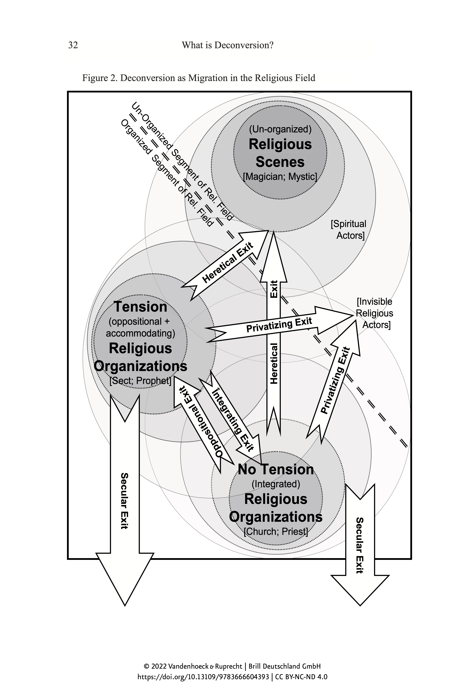
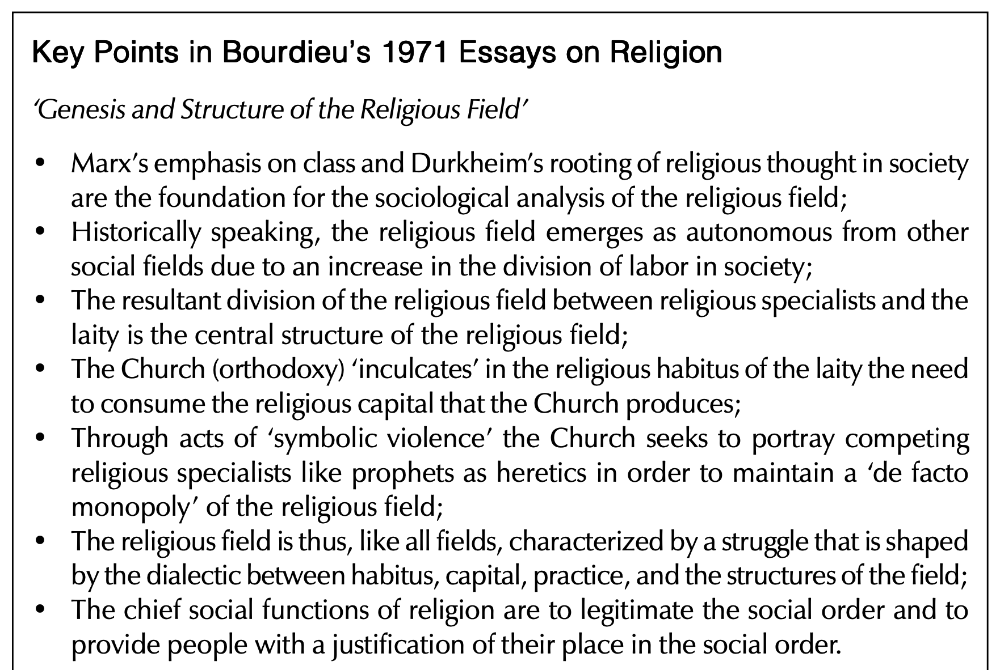

# Theorien und Methoden der Religionswissenschaft

### Pierre Bourdieu: Theorie der Praxis

Sommersemester 2024  
Prof. Dr. Catherina Wenzel & Prof. Dr. Nathan Gibson

## Rückblick: Max Weber

## Heutiges Lernziel

Ein funktionsorientiertes Modell der Religion nach Bourdieu's Begriffen "Feld", "Kapital" und "Habitus" beschreiben

## Gliederung

- Pierre Bourdieu (1930–2002): Leben & Karriere
- Funktionen der Religion
  - Feld
  - Kapital
  - Habitus

## 1. Leben & Karriere

<audio controls><source src='https://media.neuland.br.de/file/1810844/c/website/pierre-bourdieu-denker-der-feinen-unterschiede.mp3' type='audio/mp3'></audio>

<iframe data-src="assets/pdf/radiowissen-pierre-bourdieu.pdf" data-preload width="100%" height="100%"></iframe>

## 1. Leben & Karriere

- Was hat das Leben von Bourdieu mit seinen Ideen zu tun?

## 2. Funktionen der Religion

- Marx: Klassenstruktur
- Durkheim: Korrespondenz zwischen sozialen und mentalen Strukturen

## 2. Funktionen der Religion

> (Durkheim 1912 [2007], 75) Eine Religion ist ein solidarisches System von Überzeugungen und Praktiken, die sich auf heilige, d. h. abgesonderte und verbotene Dinge, Überzeugungen und Praktiken beziehen, die in einer und derselben moralischen Gemeinschaft, die man Kirche nennt, alle vereinen, die ihr angehören.

## 2. Funktionen der Religion

- Marx: Klassenstruktur
- Durkheim: Korrespondenz zwischen sozialen und mentalen Strukturen
- Weber: Produktion von symbolischen Gütern

## 2. Funktionen der Religion: Feld

> (1987 [1971], 121): the set of all the possible objective relations between positions

## 2. Funktionen der Religion: Feld

{: .r-stretch}

## 2. Funktionen der Religion: Kapital

> (2000, 77): Das religiöse Kapital, über das die unterschiedlichen religiösen Instanzen, Akteure oder Institutionen, im Konkurrenzkampf um das Monopol über die Verwaltung der Heilsgüter und der legitimen Ausübung der religiösen Macht verfügen, ist entscheidend für die Natur, die Form und die Durchsetzungskraft der Strategien, welche diese Instanzen in den Dienst der Befriedigung ihrer religiösen Interessen stellen können, sowie für die Funktionen, die sie innerhalb der Teilung der religiösen Arbeit übernehmen.

## 2. Funktionen der Religion: Habitus

> (1977 [1972], 78): “matrix of perceptions” or “the basis of perception and appreciation of all subsequent experiences”

## 2. Funktionen der Religion: Zusammengefasst 

{: .r-stretch}

(Swartz 2010, 78)

## 2. Funktionen der Religion: Zusammengefasst 

Die Religion hat die Funktion, ein System von Praktiken und Vorstellungen zu entwickeln, das sich auf das Prinzip einer natürlich-übernatürlichen Struktur des Kosmos gründet und damit die objektiv bestehenden irdischen Verhältnisse wiederholt und einprägt. Damit trägt sie zur (verschleierten) Durchsetzung der Wahrnehmungs- und Denkmuster bei...

## 2. Funktionen der Religion: Zusammengefasst 
Zur Wirkung der Legitimation kommt es allerdings nicht nur durch die Herstellung einer Entsprechung zwischen der kosmologischen Hierarchie und der sozialen und kirchlichen Hierarchie, sondern auch und vor allem durch die Auferlegung einer hierarchischen Denkweise, welche die Ordnungsbeziehungen dadurch natürlich erscheinen lässt, dass sie die Existenz privilegierter Punkte im kosmischen wie im politischen Raum setzt und/oder anerkennt. (Wenzel nach Bourdieu 2000, 97–98) 

## Agree or disagree?

> (1990b, 196): ‘God is never anything other than society. What is expected of God is only ever obtained from society, which alone has the power to justify you, to liberate you from facticity, contingency, and absurdity’

## Diskussion: Lehrevaluation